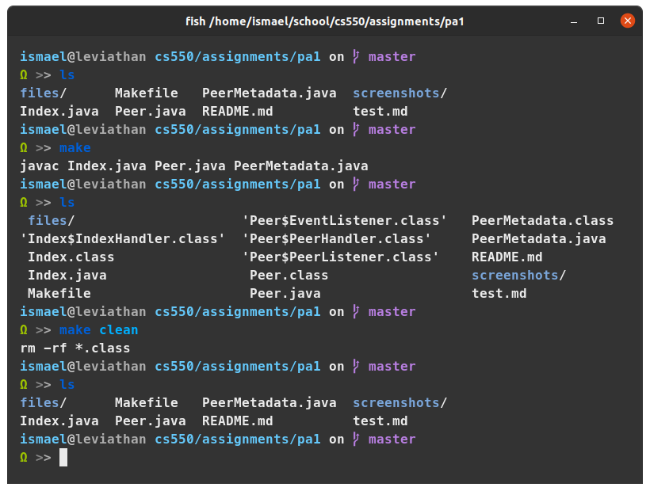
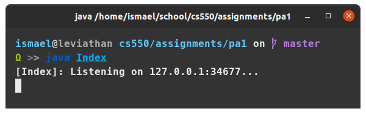
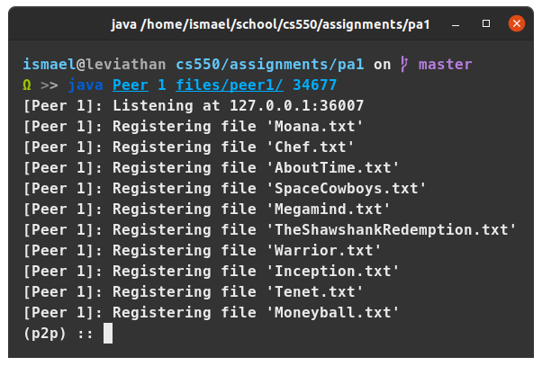

# Programming Assignment 1: P2P Network

### Ismael J Lopez - ilopez5@hawk.iit.edu

---


## Install
The code was developed and tested on an Ubuntu 20.04 machine using OpenJDK 13.

---

## Build
A `Makefile` has been provided. Running `make` will compile all the code and
running `make clean` will remove any `.class` files.

Examples:
```bash
$ make # compiles
$ make clean # cleans the auxiliary files
```

Screenshot:


---

## Running
For best usage, open several terminals: one for the Index server, and the rest
for the different Peers. I have provided files for **three** peers, in the
`files/` directory. The files within range from 1KB to 10KB and are generated
using [GenSort](http://www.ordinal.com/gensort.html). I was mostly interested
in the file sizes but just in case, I created them from different offsets so
that the contents of each file are actually different.

### Running the Index
Simply run as follows:
```
$ java Index
[Index]: Listening on 127.0.0.1:40553...
```

Screenshot:



Note: the Index server has no interactive mode, so move this to the side but
make note of the port.

### Running the Peers
The peers require three arguments: peer id, file directory, and index port number.

Example:
```bash
$ java Peer 1 files/peer1 40553
[Peer 1]: Listening at 127.0.0.1:38541  # peer's port for other peers to use
[Peer 1]: Registering file 'Moana.txt'
[Peer 1]: Registering file 'Chef.txt'
[Peer 1]: Registering file 'AboutTime.txt'
[Peer 1]: Registering file 'SpaceCowboys.txt'
[Peer 1]: Registering file 'Megamind.txt'
[Peer 1]: Registering file 'TheShawshankRedemption.txt'
[Peer 1]: Registering file 'Warrior.txt'
[Peer 1]: Registering file 'Inception.txt'
[Peer 1]: Registering file 'Tenet.txt'
[Peer 1]: Registering file 'Moneyball.txt'
```

Screenshot:




Repeat this step for any amount of peers, though I recommend up to 3 since those
files are already provided.