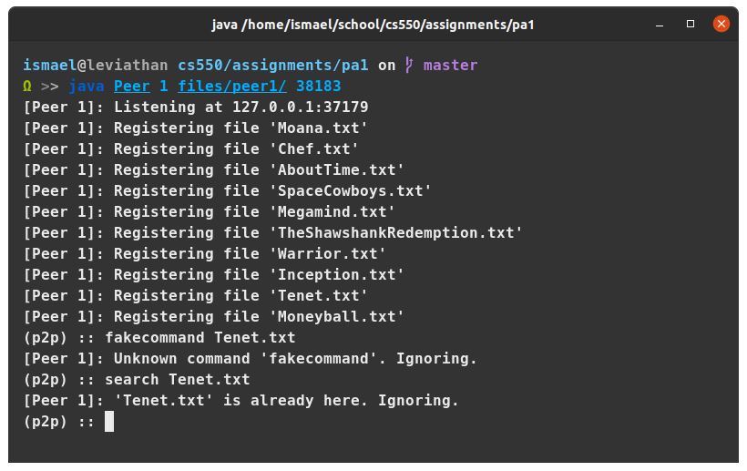

# Verification Document

## Unsupported Command
Works as expected, if the command is not 'register', 'deregister', or
'search', then it is not accepted.

## File Already On Peer
Works as expected. We save a communication by checking that the file is already
on this peer.

## Deregister a File
Works as expected. Index removes file from registry. If the file is only on that
peer, then the file is removed entirely from the registry.

## Register a File
Works as expected. Index adds the file to the registry.

## Search a File
Works as expected. Searching a file will call the Index, receive a list of
Peers for which to get it from, then download it from a peer.

## Concurrent Requests
Works as expected. I created a large 2G file on Peer 1. I then
had Peer 2 `search` that (took about 2 seconds) and quickly had Peer 1 search
for a regular sized file that Peer 2 had. The index handled both requests, and
each Peer serviced each other simultaneously.
