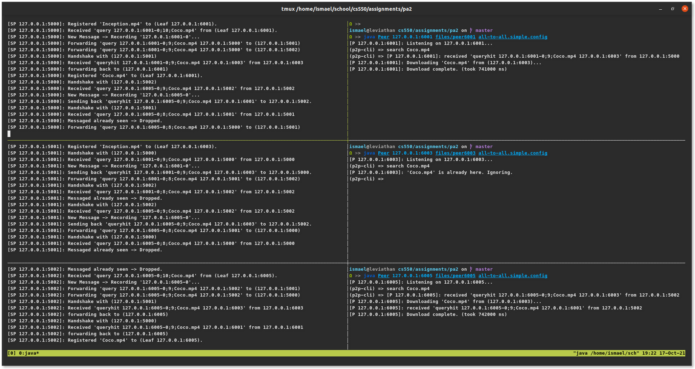

# Verification Document

For verification purposes, 3 SuperPeers were launched, each with one Leaf Peer
each (using the `*.simple.config` files). The screenshot below shows the general
output. Note the following:
1. Peer 6001 requests `Coco.mp4` and gets it from Peer 6003. This involves
    forwarding the query between the SuperPeers, as you can see from the logs.
2. Peer 6003 requests `Coco.mp4` and gets told on the client side that it already
    has that file. This saves a communication cost.
3. Peer 6005 requests `Coco.mp4` and receives two `queryhit` messages, but only
    downloads the file once. This is achieved by marking the download status
    of a file in a HashMap, and using a Lock to synchronize access to that
    HashMap.

Thus, the programs spawns threads to handle any number of requests. SuperPeers
will always forward the query to its neighbors, while decrementing the TTL. The
queryhit message is forwarded back without stopping until it hits the Leaf node
of the requester. Only one download happens per message id. Any time there is
message id that has already been handled, it is simply ignored/dropped.

If the screenshot is hard to see, the exact output is copied into `output.txt`.

Screenshot:

Please note, when you close out a Peer or SuperPeer, Exceptions arise. Due to
this being an assignment, though I tried to exit gracefully in many cases, I
simply assumed that if you are closing the program, you intend on stopping the
whole network. That being said, if you do close out a Peer and restart it,
it will once again register its files with the SuperPeer, though since the
registry is a Set, duplicates are avoided so nothing changes.